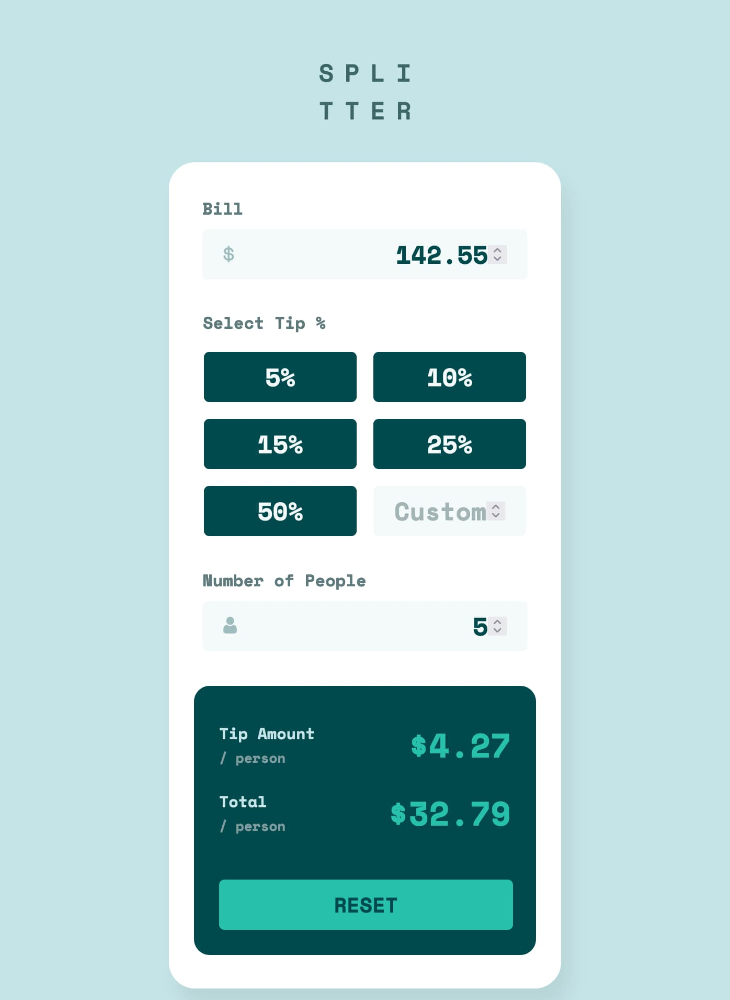

### Screenshot




### Built with

- Semantic HTML5 markup
- CSS custom properties
- Flexbox
- CSS Grid
- JavaScript

### What I learned

My first JavaScript project!

I learned a lot.

- querySelectorAll: I learned that in order to access all the elements with the same class, you need to loop through them.

- focus and blur events

- Dev tools is such a powerful tool for navigating the intricacies of a web page, espcially flexbox and grid. I love it!

- I couldn't get the tip buttons and custom tip to function properly. I learned that you need to declare this statement in order for the entire logic to work. 😅

```js
let selectedTip = 0;
```

### Challenges

- Naming classes and variables!
- This project was a challenge yet a fun one. Looking forward to the next one! 🙋🏻‍♀️

### Continued development

- I've used dev tools a lot, but I realize that I didn't utilize the console enough.
